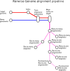

<h1>
  <picture>
    <source media="(prefers-color-scheme: dark)" srcset="docs/images/nf-core-pairgenomealign_logo_dark.png">
    
  </picture>
</h1>

[](https://github.com/nf-core/pairgenomealign/actions/workflows/ci.yml)
[](https://github.com/nf-core/pairgenomealign/actions/workflows/linting.yml)[](https://nf-co.re/pairgenomealign/results)[](https://doi:zenodo.XXXXXXX)
[](https://www.nf-test.com)

[](https://www.nextflow.io/)
[](https://docs.conda.io/en/latest/)
[](https://www.docker.com/)
[](https://sylabs.io/docs/)
[](https://cloud.seqera.io/launch?pipeline=https://github.com/nf-core/pairgenomealign)

[](https://nfcore.slack.com/channels/pairgenomealign)[](https://twitter.com/nf_core)[](https://mstdn.science/@nf_core)[](https://www.youtube.com/c/nf-core)

## Introduction

**nf-core/pairgenomealign** is a bioinformatics pipeline that aligns a single or set of query genomes in csv format with a target genome to make a pairwise representation in dotplots.

This pipeline usually takes in as an input a sample sheet in csv format which contain this set of queries or single query and align it pairwise with atarget genome in fasta or fa.gz format to make a dotplots representation of the paired alignment or alignments in case of multiple queries.



## Outputs

For each _query_ genome, this pipeline will align it to the _target_ genome, post-process the alignments and produce dot plots visualisations at different steps of the workflow. Each file contains a name suffix that indicates in which order they were created.

- `.train` is the alignment parameters computed by `last-train` (optional)
- `m2m_aln` is the _**many-to-many**_ alignment between _target_ and _query_ genomes. (optional through the `--m2m` option)
- `m2m_plot` (optional)
- `m2o_aln` is the _**many-to-one**_ alignment regions of the _target_ genome are matched at most once by the _query_ genome.
- `m2o_plot` (optional)
- `o2o_aln` is the _**one-to-one**_ alignment between the _target_ and _query_ genomes.
- `o2o_plot` (optional)
- `o2m_aln` is the _**one-to-many**_ alignment between the _target_ and _query_ genomes (optional).
- `o2m_plot` (optional)

## Mandatory parameters

- `--target`: path or URL to one genome file in FASTA format. It will be indexed.

- `--input`: path to a sample sheet in comma-separated format with one header line`sample, fasta`, and one row per genome (ID and path or URL to FASTA file).

  — or —

  `--query`: path or URL to one genome file in FASTA format.

## Options

- `--seed` selects the name of the [LAST seed][] The default (`YASS`) searches for “_long-and-weak similarities_” that “_allow for mismatches but not gaps_”. Among alternatives, there are `NEAR` for “_short-and-strong (near-identical) similarities_ … _with many gaps (insertions and deletions)_”, `MAM8` to find _“weak
  similarities with high sensitivity, but low speed and high memory usage”_
  or `RY128` that “_reduces run time and memory use, by only seeking seeds at
  ~1/128 of positions in each sequence_”, which is useful when the purpose of
  running this pipeline is only to generate whole-genome dotplots, or when
  sensitivity for tiny fragments may be unnecessary or undesirable. Setting
  the seed to `PSEUDO` triggers protein-to-DNA alignment mode (experimental).

- `--lastal_args` defaults to `-C2` and is applied to both
  the calls to `last-train` and `lastal`, like in the [LAST cookbook][]
  and the [last-genome-alignments][] tutorial.

- `--lastal_extr_args` (default: `-D1e9`) is only passed to `lastal` and
  can be used for arguments that are not recognised by `last-train`.

- `--lastal_params`: path to a file containing alignment parameters
  computed by [`last-train`][] or a [scoring matrix][]. If this option
  is not used, the pipeline will run `last-train` for each query.

- `--m2m`: (default: false) Compute and output the many-to-many alignment.
  This adds time and can comsume considerable amount of space; use only
  if you need that data.

- `--o2m`: (default: false) Also compute the _**one-to-many**_ alignments
  and dotplots. This is sometimes useful when troubleshooting the
  preparation of diploid assemblies.

- `--one_to_one_only`: do not copy the other alignments to the results
  folder, thus saving disk space.

- By default, `last-split` runs with `-m1e-5` to omit alignments with
  mismap probability > 10<sup>−5</sup>, but this can be overriden with
  the `--last_split_mismap` option.

- `--last_split_args` defaults to empty value and is not very useful at the
  moment, but is kept for backwards compatibility. It can be used to pass
  options to `last-split`. Note that if you used `--m2m false` (which is
  the default), the split parameters have to be passed in
  `--lastal_extra_args` and have different names (see _split options_ in the
  [lastal documentation][]).

- The dotplots can be modified by overriding defaults and passing new
  arguments via the `--dotplot_options` argument. Defaults and available
  options can be seen on the manual page of the [`last-dotplot`][] program.
  By default in this pipeline, the sequences of the _query_ genome are
  sorted and oriented by their alignment to the _target_ genome
  (`--sort2=3 --strands2=1`). For readability, their names are written
  horizontally (`--rot2=h`).

- Use `--skip_dotplot_m2m`, `--skip_dotplot_m2o`, `--skip_dotplot_o2o`
  `--skip_dotplot_o2m` to skip the production of the dot plots that can be
  computationally expensive and visually uninformative on large genomes with
  shared repeats. File suffixes (see above) will not change.

- By default the LAST index is named `target` and the ouput files are named
  from the query IDs. Use the `--targetName` option to provide a name
  that will be used for the LAST index and that will be prefixed to the
  query IDs with a `___` separator.

[`lastal`]: https://gitlab.com/mcfrith/last/-/blob/main/doc/lastal.rst
[`last-dotplot`]: https://gitlab.com/mcfrith/last/-/blob/main/doc/last-dotplot.rst
[LAST seed]: https://gitlab.com/mcfrith/last/-/blob/main/doc/last-seeds.rst
[LAST cookbook]: https://gitlab.com/mcfrith/last/-/blob/main/doc/last-cookbook.rst
[`last-train`]: https://gitlab.com/mcfrith/last/-/blob/main/doc/last-train.rst
[LAST tuning]: https://gitlab.com/mcfrith/last/-/blob/main/doc/last-tuning.rst
[scoring matrix]: https://gitlab.com/mcfrith/last/-/blob/main/doc/last-matrices.rst
[lastal documentation]: https://gitlab.com/mcfrith/last/-/blob/main/doc/lastal.rst
[last-genome-alignments]: https://github.com/mcfrith/last-genome-alignments

## Fixed arguments (taken from the [LAST cookbook][] and the [LAST tuning][] manual)

- The `lastdb` step soft-masks simple repeats by default, (`-c -R01`).It indexes both strands (`-S2`), which increases speed at the expense of memory usage.

- The `last-train` commands runs with `--revsym` as the DNA strands play equivalent roles in the studied genomes, unless the `--read_align` option is selected.

- `last-split` runs with `-fMAF+` to make it show per-base mismap probabilities, except in read alignment mode (see below).

## Usage

> [!NOTE]
> If you are new to Nextflow and nf-core, please refer to [this page](https://nf-co.re/docs/usage/installation) on how to set-up Nextflow. Make sure to [test your setup](https://nf-co.re/docs/usage/introduction#how-to-run-a-pipeline) with `-profile test` before running the workflow on actual data.

First, prepare a samplesheet with your input data that looks as follows:

`samplesheet.csv`:

```csv
sample,fasta
Query_1,AEG588A1_S1_L002_R1_001.fasta
```

Each row represents a fasta file, this can also contain multiple rows to accomodate multiple query genomes in fasta format.

Now, you can run the pipeline using:

```bash
nextflow run nf-core/pairgenomealign \
   -profile <docker/singularity/.../institute> \
   --target sequencefile.fa \
   --input samplesheet.csv \
   --outdir <OUTDIR>
```

> [!WARNING]
> Please provide pipeline parameters via the CLI or Nextflow `-params-file` option. Custom config files including those provided by the `-c` Nextflow option can be used to provide any configuration _**except for parameters**_;
> see [docs](https://nf-co.re/usage/configuration#custom-configuration-files).

For more details and further functionality, please refer to the [usage documentation](https://nf-co.re/pairgenomealign/usage) and the [parameter documentation](https://nf-co.re/pairgenomealign/parameters).

## Pipeline output

To see the results of an example test run with a full size dataset refer to the [results](https://nf-co.re/pairgenomealign/results) tab on the nf-core website pipeline page.
For more details about the output files and reports, please refer to the
[output documentation](https://nf-co.re/pairgenomealign/output).

## Credits

nf-core/pairgenomealign was originally written by charles-plessy.

We thank the following people for their extensive assistance in the development of this pipeline:
...

## Contributions and Support

If you would like to contribute to this pipeline, please see the [contributing guidelines](.github/CONTRIBUTING.md).

For further information or help, don't hesitate to get in touch on the [Slack `#pairgenomealign` channel](https://nfcore.slack.com/channels/pairgenomealign) (you can join with [this invite](https://nf-co.re/join/slack)).

## Citations

If you use this pipeline, please cite:

Extreme genome scrambling in marine planktonic Oikopleura dioica cryptic species. Charles Plessy, Michael J. Mansfield, Aleksandra Bliznina, Aki Masunaga, Charlotte West, Yongkai Tan, Andrew W. Liu, Jan Grašič, María Sara del Río Pisula, Gaspar Sánchez-Serna, Marc Fabrega-Torrus, Alfonso Ferrández-Roldán, Vittoria Roncalli, Pavla Navratilova, Eric M. Thompson, Takeshi Onuma, Hiroki Nishida, Cristian Cañestro, Nicholas M. Luscombe. Genome Res. 2024. 34: 426-440; doi:[10.1101/2023.05.09.539028](https://doi.org/10.1101/gr.278295.123). PubMed ID: [38621828](https://pubmed.ncbi.nlm.nih.gov/38621828/)

[OIST research news article](https://www.oist.jp/news-center/news/2024/4/25/oikopleura-who-species-identity-crisis-genome-community)

And also please cite the [LAST papers](https://gitlab.com/mcfrith/last/-/blob/main/doc/last-papers.rst).

An extensive list of references for the tools used by the pipeline can be found in the [`CITATIONS.md`](CITATIONS.md) file.

You can cite the `nf-core` publication as follows:

> **The nf-core framework for community-curated bioinformatics pipelines.**
>
> Philip Ewels, Alexander Peltzer, Sven Fillinger, Harshil Patel, Johannes Alneberg, Andreas Wilm, Maxime Ulysse Garcia, Paolo Di Tommaso & Sven Nahnsen.
>
> _Nat Biotechnol._ 2020 Feb 13. doi: [10.1038/s41587-020-0439-x](https://dx.doi.org/10.1038/s41587-020-0439-x).
