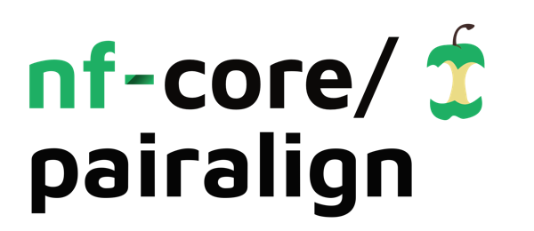
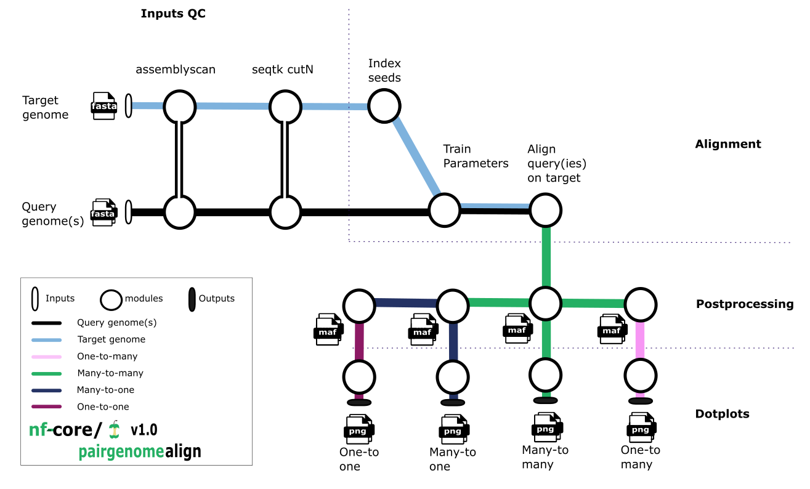

<h1>
  <picture>
    <source media="(prefers-color-scheme: dark)" srcset="docs/images/nf-core-pairgenomealign_logo_dark.png">
    
  </picture>
</h1>

[](https://github.com/nf-core/pairgenomealign/actions/workflows/ci.yml)
[](https://github.com/nf-core/pairgenomealign/actions/workflows/linting.yml)[](https://nf-co.re/pairgenomealign/results)[](https://doi.org/10.5281/zenodo.XXXXXXX)
[](https://www.nf-test.com)

[](https://www.nextflow.io/)
[](https://docs.conda.io/en/latest/)
[](https://www.docker.com/)
[](https://sylabs.io/docs/)
[](https://cloud.seqera.io/launch?pipeline=https://github.com/nf-core/pairgenomealign)

[](https://nfcore.slack.com/channels/pairgenomealign)[](https://twitter.com/nf_core)[](https://mstdn.science/@nf_core)[](https://www.youtube.com/c/nf-core)

## Introduction

**nf-core/pairgenomealign** is a bioinformatics pipeline that aligns one or more _query_ genomes to a _target_ genome, and plots pairwise representations.



The pipeline can generate four kinds of outputs, called _many-to-many_, _many-to-one_, _one-to-many_ and _one-to-one_, depending on whether sequences of one genome are allowed match the other genome multiple times or not.

These alignments are output in [MAF](https://genome.ucsc.edu/FAQ/FAQformat.html#format5) format, and optional line plot representations are output in PNG format.

## Usage

> [!NOTE]
> If you are new to Nextflow and nf-core, please refer to [this page](https://nf-co.re/docs/usage/installation) on how to set-up Nextflow. Make sure to [test your setup](https://nf-co.re/docs/usage/introduction#how-to-run-a-pipeline) with `-profile test` before running the workflow on actual data.

First, prepare a samplesheet with your input data that looks as follows:

`samplesheet.csv`:

```csv
sample,fasta
query_1,path-to-query-genome-file-one.fasta
query_2,path-to-query-genome-file-two.fasta
```

Each row represents a fasta file, this can also contain multiple rows to accomodate multiple query genomes in fasta format.

Now, you can run the pipeline using:

```bash
nextflow run nf-core/pairgenomealign \
   -profile <docker/singularity/.../institute> \
   --target sequencefile.fa \
   --input samplesheet.csv \
   --outdir <OUTDIR>
```

> [!WARNING]
> Please provide pipeline parameters via the CLI or Nextflow `-params-file` option. Custom config files including those provided by the `-c` Nextflow option can be used to provide any configuration _**except for parameters**_; see [docs](https://nf-co.re/docs/usage/getting_started/configuration#custom-configuration-files).

For more details and further functionality, please refer to the [usage documentation](https://nf-co.re/pairgenomealign/usage) and the [parameter documentation](https://nf-co.re/pairgenomealign/parameters).

## Pipeline output

To see the results of an example test run with a full size dataset refer to the [results](https://nf-co.re/pairgenomealign/results) tab on the nf-core website pipeline page.
For more details about the output files and reports, please refer to the
[output documentation](https://nf-co.re/pairgenomealign/output).

## Credits

`nf-core/pairgenomealign` was originally written by [charles-plessy](https://github.com/charles-plessy); the original versions are available at <https://github.com/oist/plessy_pairwiseGenomeComparison>.

We thank the following people for their extensive assistance in the development of this pipeline:

- [Mahdi Mohammed](https://github.com/U13bs1125) ported the original pipeline to _nf-core_ template 2.14.x.
- [Martin Frith](https://github.com/mcfrith/), the author of LAST, gave us extensive feedback and advices.
- [Michael Mansfield](https://github.com/mjmansfi) tested the pipeline and provided critical comments.
- [Aleksandra Bliznina](https://github.com/aleksandrabliznina) contributed to the creation of the initial `last/*` modules.
- [Jiashun Miao](https://github.com/miaojiashun) and [Huyen Pham](https://github.com/ngochuyenpham) tested the pipeline on vertebrate genomes.

## Contributions and Support

If you would like to contribute to this pipeline, please see the [contributing guidelines](.github/CONTRIBUTING.md).

For further information or help, don't hesitate to get in touch on the [Slack `#pairgenomealign` channel](https://nfcore.slack.com/channels/pairgenomealign) (you can join with [this invite](https://nf-co.re/join/slack)).

## Citations

If you use this pipeline, please cite:

> **Extreme genome scrambling in marine planktonic Oikopleura dioica cryptic species.**
> Charles Plessy, Michael J. Mansfield, Aleksandra Bliznina, Aki Masunaga, Charlotte West, Yongkai Tan, Andrew W. Liu, Jan Grašič, María Sara del Río Pisula, Gaspar Sánchez-Serna, Marc Fabrega-Torrus, Alfonso Ferrández-Roldán, Vittoria Roncalli, Pavla Navratilova, Eric M. Thompson, Takeshi Onuma, Hiroki Nishida, Cristian Cañestro, Nicholas M. Luscombe.
> _Genome Res._ 2024. 34: 426-440; doi: [10.1101/2023.05.09.539028](https://doi.org/10.1101/gr.278295.123). PubMed ID: [38621828](https://pubmed.ncbi.nlm.nih.gov/38621828/)

[OIST research news article](https://www.oist.jp/news-center/news/2024/4/25/oikopleura-who-species-identity-crisis-genome-community)

And also please cite the [LAST papers](https://gitlab.com/mcfrith/last/-/blob/main/doc/last-papers.rst).

An extensive list of references for the tools used by the pipeline can be found in the [`CITATIONS.md`](CITATIONS.md) file.

You can cite the `nf-core` publication as follows:

> **The nf-core framework for community-curated bioinformatics pipelines.**
>
> Philip Ewels, Alexander Peltzer, Sven Fillinger, Harshil Patel, Johannes Alneberg, Andreas Wilm, Maxime Ulysse Garcia, Paolo Di Tommaso & Sven Nahnsen.
>
> _Nat Biotechnol._ 2020 Feb 13. doi: [10.1038/s41587-020-0439-x](https://dx.doi.org/10.1038/s41587-020-0439-x).
